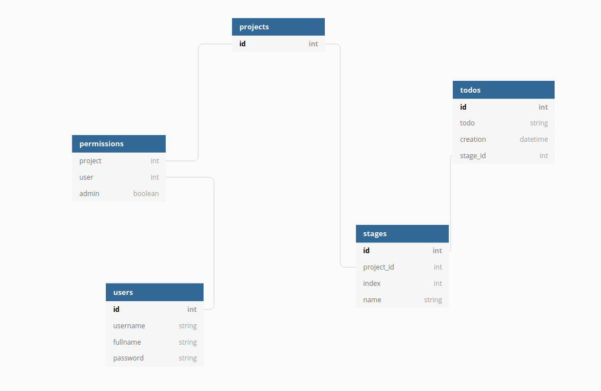

# Kanban board

[](https://tsoha-kanban.herokuapp.com/)

## Description
A virtual Kanban board.

## Documentation

This project has a demo [here](https://tsoha-kanban.herokuapp.com/). Please do not use the demo for real projects. Install and run the project on your own machine instead.

### Installation
#### Local
This project requires Python

1. Copy the repository to your local machine
2. Open a terminal in the project's root folder
3. Create a new virtual environment with `python -m venv venv`
4. Activate your virtual environment with `source venv/bin/activate`
5. Install the dependencies with `pip install -r requirements.txt`
6. Run the project with `python run.py`

#### Heroku
1. Install the [Heroku CLI](https://devcenter.heroku.com/articles/heroku-cli) and [git](https://git-scm.com/), if you haven't already.
2. Download the project source code
3. Go to the project root folder using your terminal
4. Create your heroku project with `heroku create <project-name>`
5. Initialize git with `git init`
6. Add a git remote with `git remote add heroku https://git.heroku.com/<project-name>.git`
7. Push your project to heroku with `git add .`, `git commit -m""` and `git push heroku master`
8. Your project is now available at `<your-project>.herokuapp.com`

### Usage
These simple steps showcase all the features.

1. Register an account or log in
2. Create a new project
3. Go to List projects -> Edit, to enter the admin panel.
4. In this panel, you can change your projects name, add stages to your project, and add other users to your project (you can also grant them admin priviledges).
5. !WARNING! IF YOU ADD ANOTHER USER AS AN ADMIN, THEY HAVE THE ABILITY TO REMOVE YOU FROM THE PROJECT
4. Go to List projects -> Your project name, and add todos to the first stage
5. When a todo is ready, advance it to the next stage

### User stories
You can find user stories [here](documentation/user_stories.md)
## Database
### Graph

### Tables
```
CREATE TABLE project (
	id INTEGER NOT NULL, 
	date_created DATETIME, 
	date_modified DATETIME, 
	name VARCHAR(144) NOT NULL, 
	PRIMARY KEY (id)
);
CREATE TABLE account (
	id INTEGER NOT NULL, 
	date_created DATETIME, 
	date_modified DATETIME, 
	username VARCHAR(144) NOT NULL, 
	fullname VARCHAR(144) NOT NULL, 
	password VARCHAR(144) NOT NULL, 
	PRIMARY KEY (id), 
	UNIQUE (username)
);
CREATE TABLE permission (
	id INTEGER NOT NULL, 
	date_created DATETIME, 
	date_modified DATETIME, 
	project_id INTEGER NOT NULL, 
	user_id INTEGER NOT NULL, 
	admin BOOLEAN NOT NULL, 
	PRIMARY KEY (id), 
	CONSTRAINT project_user_uc UNIQUE (project_id, user_id), 
	FOREIGN KEY(project_id) REFERENCES project (id), 
	FOREIGN KEY(user_id) REFERENCES account (id), 
	CHECK (admin IN (0, 1))
);
CREATE TABLE stage (
	id INTEGER NOT NULL, 
	date_created DATETIME, 
	date_modified DATETIME, 
	project_id INTEGER NOT NULL, 
	"index" INTEGER NOT NULL, 
	name VARCHAR NOT NULL, 
	PRIMARY KEY (id), 
	CONSTRAINT project_index_uc UNIQUE (project_id, "index"), 
	FOREIGN KEY(project_id) REFERENCES project (id)
);
CREATE TABLE todo (
	id INTEGER NOT NULL, 
	date_created DATETIME, 
	date_modified DATETIME, 
	stage_id INTEGER, 
	text VARCHAR NOT NULL, 
	PRIMARY KEY (id), 
	FOREIGN KEY(stage_id) REFERENCES stage (id)
);
```
