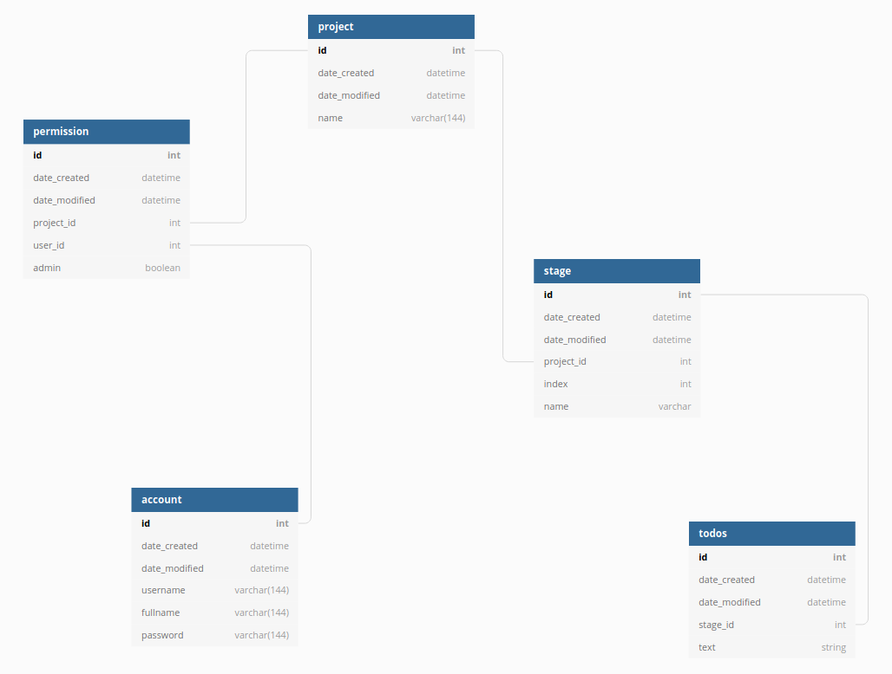

# Kanban board

## Description
A virtual Kanban board.

## Documentation

This project has a demo [here](https://tsoha-kanban.herokuapp.com/). Please do not use the demo for real projects. Install and run the project on your own machine instead.

### Installation
This project requires Python

1. Copy the repository to your local machine
2. Open a terminal in the project's root folder
3. Create a new virtual environment with `python -m venv venv`
4. Activate your virtual environment with `source venv/bin/activate`
5. Install the dependencies with `pip install -r requirements.txt`
6. Run the project with `python run.py`

### Usage
1. Register an account or log in
2. Create a new project if you haven't already
3. Go to List projects -> Edit, and add stages
4. Go to List projects -> Your project name, and add todos to the first stage
5. When a todo is ready, advance it to the next stage

### User stories
You can find user stories [here](documentation/user_stories.md)
### Database graph

